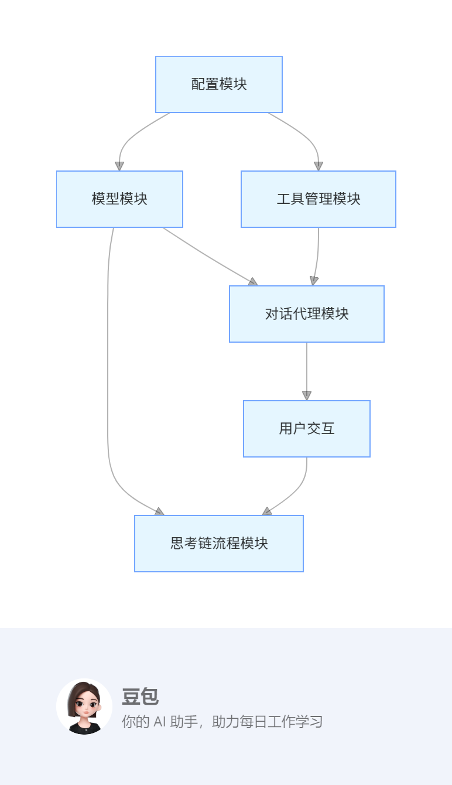
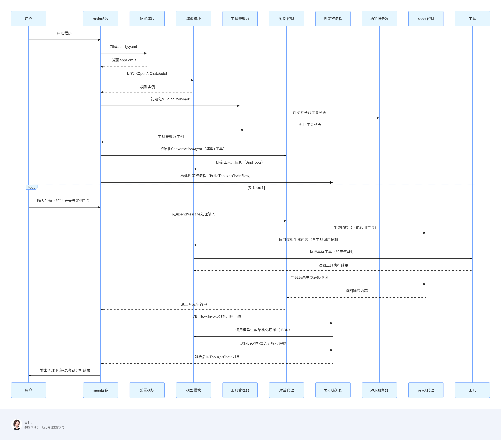

# eino-mcp 仓库运行流程与框架说明文档

## 一、整体架构概览
eino-mcp 是一个基于大语言模型（LLM）的智能对话系统，核心功能包括**多工具调用对话代理**和**结构化思考链分析**。系统通过整合模型服务、工具管理、流程编排等模块，实现了支持工具调用的智能对话和结构化思考过程的输出。

## 二、核心模块架构图


## 三、模块详细说明

### 1. 配置模块（config）
**职责**：加载系统运行所需的配置参数（如模型服务地址、API 密钥、MCP 工具服务器地址等）。

**关键组件**：
- AppConfig：总配置结构体，包含MCPConfig（MCP 工具服务器配置）和OpenAIConfig（OpenAI 模型配置）。
- LoadConfig：通过viper加载config.yaml配置文件，支持环境变量覆盖。
- 配置文件示例（config.yaml）：
    ```yaml
       mcp:
       server_url: "http://localhost:12345/sse"  # MCP工具服务器地址
       openai:
       api_key: "sk-14d8e0db18214302a2ae13e493094d98"  # OpenAI API密钥
       base_url: "https://dashscope.aliyuncs.com/compatible-mode/v1"  # 模型服务地址
       model: "qwen-plus"                         # 模型名称
    ```
### 2. 模型模块（model）
**职责**：封装大语言模型（如 OpenAI）的交互逻辑，支持工具绑定能力。
**关键组件**：
- ChatModel接口：继承eino框架的BaseChatModel，扩展BindTools方法（绑定工具元信息到模型）。
- OpenAIChatModel：OpenAI 模型的具体实现，通过eino-ext的openai组件初始化模型客户端。

**核心流程**： 模型初始化时读取 OpenAI 配置（API 密钥、服务地址等），通过BindTools将工具元信息（如工具描述、参数）传递给模型，使模型具备工具调用意识。
### 3. 工具管理模块（tool）
**职责**：从 MCP（Multi-Tool Control Protocol）服务器获取可用工具，并管理工具生命周期。

**关键组件**：
- Tool接口：继承eino的BaseTool，扩展Info方法（返回工具元信息）。
- MCPToolManager：MCP 工具管理器，通过mcp-go客户端与 MCP 服务器通信，获取工具列表并封装为Tool接口实例。
  
**核心流程**： 通过NewMCPToolManager初始化 MCP 客户端→调用GetTools从服务器获取工具列表→工具通过Info方法提供元信息（如名称、描述、参数）→工具列表绑定到模型（model.BindTools）。
### 4. 对话代理模块（agent）
**职责**：处理用户对话，支持动态调用工具解决问题。

**关键组件**：
- ConversationAgent：对话代理结构体，持有模型、工具列表和对话历史。
- SendMessage方法：处理用户输入，通过react.NewAgent创建支持工具调用的代理实例→调用agent.Generate生成响应→更新对话历史。
   
**核心流程（用户输入处理）**： 用户输入→创建UserMessage→通过react代理（支持工具调用）生成响应→响应内容包含工具调用过程或直接答案→更新对话历史并返回。
### 5. 思考链流程模块（thoughtchain）
**职责**：对用户问题进行结构化分析，输出分步思考过程和最终答案。
   
**关键组件**：
- ThoughtChain结构体：包含Steps（思考步骤数组）和Answer（最终答案）。
- BuildThoughtChainFlow函数：构建思考链流程，通过eino的compose框架编排： 提示模板（promptTemplate）→ 模型调用（model）→ JSON解析（parseLambda）。
   
**核心流程**： 用户问题→通过提示模板生成结构化请求（要求模型输出 JSON 格式的步骤和答案）→模型生成响应→解析 JSON 内容为ThoughtChain对象→输出步骤和答案。

## 四、整体运行流程图



## 五、关键特性说明
- **工具调用能力**：通过 MCP 协议动态获取工具，模型基于工具元信息（描述、参数）自动生成调用逻辑，支持复杂问题的分步解决。
- **结构化思考输出**：思考链流程通过提示工程强制模型输出 JSON 格式的步骤和答案，便于后续系统解析和利用（如日志记录、结果验证）。
- **对话状态管理**：ConversationAgent维护对话历史（messages），支持多轮对话上下文感知。

## 六、依赖说明
- **核心框架**：使用cloudwego/eino作为 LLM 流程编排框架，eino-ext提供模型和工具的扩展支持。
- **配置管理**：依赖spf13/viper加载 YAML 配置文件。
- **MCP 协议**：通过mark3labs/mcp-go客户端与 MCP 工具服务器通信。
- **模型交互**：eino-ext/components/model/openai封装 OpenAI（或兼容服务，如阿里云 DashScope）的模型调用。
- **其他依赖**：包括日志库sirupsen/logrus、并发库sourcegraph/conc、YAML 解析库gopkg.in/yaml.v3等。
## 七、总结
eino-mcp通过模块化设计实现了智能对话系统的核心能力，支持动态工具扩展和结构化思考分析，适用于需要多工具协同、可解释性思考过程的场景（如智能客服、数据分析助手）。